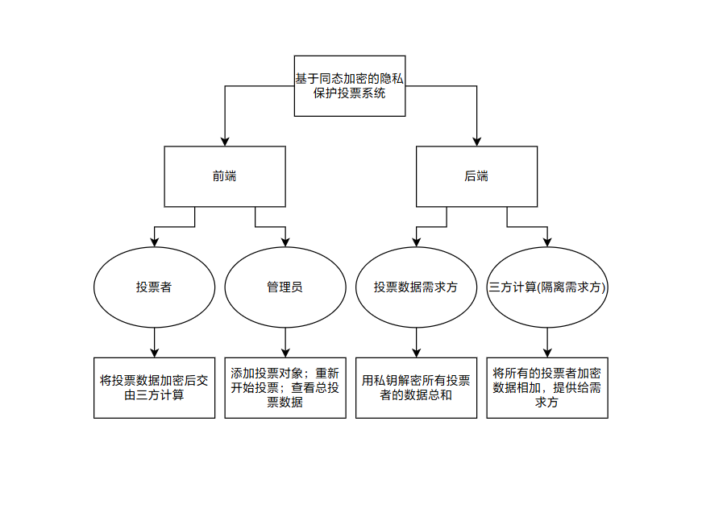
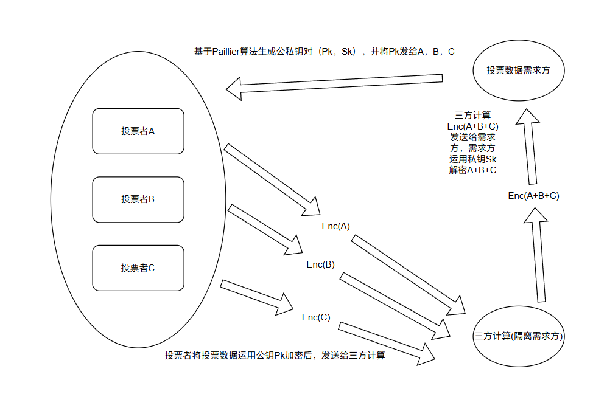

# 基于同态加密的隐私保护投票系统

## 框架图



## 密码学安全逻辑



## 后端接口文档

### 数据需求方 `端口号：5000`

1. **获取公钥**：

- URL: /get_pubkey
- method: POST
- response:

已经存在密钥对，直接返回公钥

```json
{
    "status": "success",
    "message": "Public key fetched",
    "key": [123, 123]
}
```

没有密钥对，生成密钥对并返回公钥

```json
{
    "status": "success",
    "message": "Public key generated",
    "key": [123, 123]
}
```

2. **重新开始投票（删除密钥对,删除投票对象信息,删除投票结果）**：

- URL: /restart
- method: POST
- response:

```json
{
    "status": "success",
    "message": "Restart success"
}
```

3. **设置投票信息**：

- URL: /set_vote_info
- method: POST
- request:

```json
{
    "list": ["teacher1", "teacher2", "teacher3"]
}
```

- response:

```json
{
    "status": "success",
    "message": "Vote info saved"
}
```

4. **获取投票信息**：

- URL: /get_vote_info
- method: POST
- response:

```json
{
    "status": "success",
    "message": "Vote info fetched",
    "list": ["teacher1", "teacher2", "teacher3"]
}
```

Error:

```json
{
    "status": "error",
    "message": "No vote info"
} 
```

5. **获取投票结果**：

- URL: /get_vote_result
- method: POST
- response:

分数为总分

```json
{
    "status": "success",
    "message": "Vote result fetched",
    "result": {
        "teacher1": 123,
        "teacher2": 123,
        "teacher3": 123
    },
    "vote_people_number":123
}
```

6. **接收加密投票**：`三方计算接口`

- URL: /receive_vote
- method: POST
- request:

```json
{
    "vote_sum":{
        "teacher1":123,
        "teacher2":123,
        "teacher3":123
    },
    "user_sum":["userA","userB"]
}
```

- response:

```json
{
    "status": "success",
    "message": "Vote received"
}
```

### 三方计算 `端口号：5001`

1. **重新开始投票（删除加密投票信息）**：

- URL: /restart
- method: POST
- response:

```json
{
    "status": "success",
    "message": "Restart success"
}
```

2. **提交加密投票**：

- URL: /submit_vote
- method: POST
- request:

```json
{
    "username": "userA",
    "vote": {
        "teacher1":123,
        "teacher2":123,
        "teacher3":123
    },
    "pubkey": [123, 123]
}
```

- response:

```json
{
    "status": "success",
    "message": "Vote submitted"
}
```
